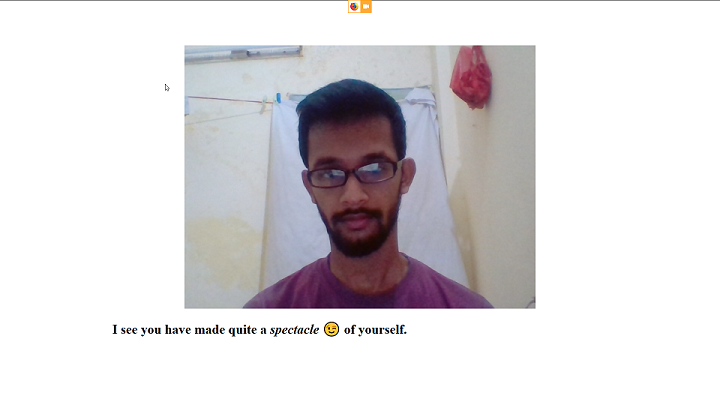
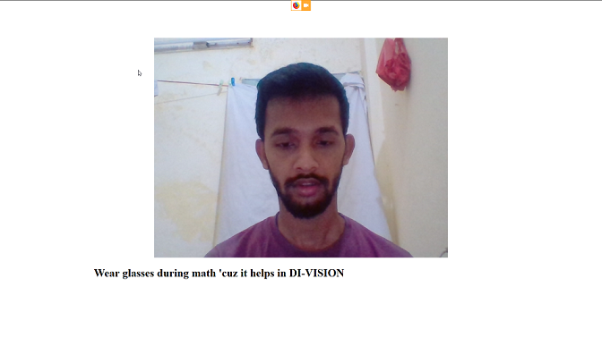

# Glasses

Checks if the user is wearing any glasses or not

 

Technologies used
---
* PyTorch
* Flask

Main Things Learnt
---
* Creation of own Datasets
* Use of Pretrained Models
* Deploying Pytorch models over Flask server

Features to add
---
- [x] Add webcam support to take pictures on the page
- [x] Asynchronously add real time detection and witty comments [Thanks to @memahesh](https://github.com/Mianto/glasses/pull/1)
- [ ] Make homepage more presentable

Installation / Testing
---
- Clone the repository `git clone https://github.com/Mianto/glasses.git` and change the folder to Glasses.
- Install the dependencies `pip install requirements.txt`
- Change folder to `glasses` and run the flask app using `python app.py`

Files
---
* `glasses.ipynb` used for training the model
* `saliency.ipynb` gives the saliency map for the image